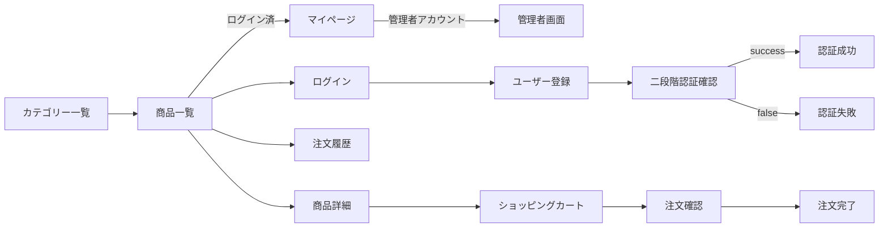

## [実装済機能](https://github.com/rpentry202204w/ec-202204c/issues?q=is%3Aissue+is%3Aclosed)
<details>
  <summary><strong>各ページの実装</strong></summary>

#### サイトマップ

</details>
<details>
  <summary><strong>注文完了自動送信メール機能</strong></summary>
<br />

**Spring-boot-Starter-mail**を使用し、注文確定後に自動でメールを送信できるよう実装いたしました。  
使用する場合は以下のコードをpom.xmlに追加してください。

```pom.xml
<dependency>
	<groupId>org.springframework.boot</groupId>
	<artifactId>spring-boot-starter-mail</artifactId>
</dependency>
```

[SendmailServiceクラス](https://github.com/rpentry202204w/ec-202204c/blob/main/src/main/java/com/example/demo/service/SendMailService.java)を作成しました。

```Java :SendmailService
/**商品注文確定の際に送られるメール送信用メソッド＊*/
public void sendMessageWhenUserBuysItem() {
	User user = (User) session.getAttribute("user");
	String TEXT = "" + "　---------------------------------------\n" + "　この度は【らくらくPC】をご利用いただきありがとうございました。\n"
			+ "　ご注文番号「XXXX-XXXX-XXXX」で受け付けいたしました。\n" + "　本メール到着後は、商品や本サービスにおけるご注文はキャンセル・変更できません。\n"
			+ "　ご不明な点がございましたら、下記からお問い合わせください。\n" + "　連絡先：XXX-XXXX-XXXX\n"
			+ " ---------------------------------------";
	SimpleMailMessage msg = new SimpleMailMessage();
	msg.setTo(user.getEmail()); // 送り手のアドレス
	msg.setSubject("【ご注文を受け付けました】");// タイトル
	msg.setText(TEXT);
	mailSender.send(msg);
}
```
</details>

<details>
  <summary><strong>ユーザー登録、入力値エラーチェック、ログインログアウト機能</strong></summary>
  <br />

新規ユーザー登録画面を実装しました。入力不備があった場合、入力値エラーチェックが働きます。


[UserController](https://github.com/rpentry202204w/ec-202204c/blob/main/src/main/java/com/example/demo/controller/UserController.java)において、パスワードの設定条件を指定しています。正規表現を用いて**8文字以上16文字以下かつアルファベット大文字小文字記号を１つ以上**という厳しい条件をかけています。

```Java
for (String word : words) {
	if (word.matches("[A-Z]")) {
		upperCase = 1;
	} else if (word.matches("[a-z]")) {
		lowerCase = 1;
	} else if (word.matches("[-!\"#$%&'@()=~|^\\\\]")) { // [!\"#$%&'()=~|-^\\]
		symbol = 1;
	} else if (word.matches("[0-9]")) {
		num = 1;
	}
}
```  
</details>

<details>
  <summary><strong>新規登録フォームの郵便番号入力部分の住所検索機能</strong></summary>
 <br />
 
 [ZIPCODA API](https://zipcoda.net/doc)を使用して、郵便番号から住所の検索ができるように実装いたしました。
 
 ```mermaid
 flowchart LR
	 Cliant --GET or POST--> RESTAPI
	 RESTAPI --HTTP Request--> Server 
	 Server --HTTP Response--> RESTAPI
	 RESTAPI --JSONP--> Cliant
 ```
 
 ```JavaScript
 $(function(){
    $(document).on('click', '#get_address_btn', function(){
        $.ajax({
            url: 'http://zipcoda.net/api',
            dataType: 'jsonp',
            data: {
                zipcode: $('#inputZipcode').val()
            },
            async: true
        }).done(function(data){
            console.dir(JSON.stringify(data));
            $('#inputAddress').val(data.items[0].address);
        }).fail(function(XMLHttpRequest, textStatus, errorThrown){
            alert('正しい結果を得られませんでした。');
            console.log('XMLHttpRequest:' + XMLHttpRequest.status);
            console.log('textStatus:' + textStatus);
            console.log('errorThrown:' + errorThrown.message);
        });
    });
});
 ```
</details>

<details>
  <summary><strong>商品の数量とオプション選択と連動する金額の動的変更処理</strong></summary>
  <br />
  
  [jQuery](https://github.com/rpentry202204w/ec-202204c/blob/main/src/main/resources/static/js/item.js)を使用して、ユーザーの処理に合わせて動的に金額が変化するような機能を実装いたしました。  
  (jQueryは現在主流でないため、JavaScriptでの実装に切り替えています。)
  
  ```jQuery
  let cpuCurrentNum = $(".cpu").val();
	$(".cpu").on("change", function() {
		let num = $(".form-control").val();//数量
		let cpuChangedNum = $(".cpu").val();
		let changeNumber = cpuChangedNum - cpuCurrentNum

		if (changeNumber == 1) {//変化が１のとき
			if (cpuCurrentNum == 1) {
				cpuPrice += 15000;
			} else {
				cpuPrice += 20000;
				}
			} else if (changeNumber == 2) {//変化が２のとき
				if (cpuCurrentNum == 1) {
				cpuPrice += 35000;
			} else {
				cpuPrice += 40000;
			}
			} else if (changeNumber == 3) {//変化が３のとき
				cpuPrice += 55000;
			} else if (changeNumber == -1) {//変化が-1のとき
				if (cpuCurrentNum == 2) {
					cpuPrice += -15000;
				} else {
					cpuPrice += -20000;
				}
			} else if (changeNumber == -2) {//変化が-2のとき
				if (cpuCurrentNum == 3) {
					cpuPrice += -35000;
				}
				cpuPrice += -40000;
			} else if (changeNumber == -3) {//変化が-3のとき
				cpuPrice += -55000;
			}
			cpuCurrentNum = cpuChangedNum;
  ```
  
  
</details>

<details>
  <summary><strong>スライダー機能</strong></summary>
  <br />
  
  商品一覧ページにおけるスライダー機能を実装するため、[slickプラグイン](http://kenwheeler.github.io/slick/)を導入いたしました。
 
</details>

<details>
  <summary><strong>ページング機能</strong></summary>
  <br />
  
 商品一覧ページにおけるページング機能を実装するため、[Pagenationプラグイン](https://github.com/alfrcr/paginathing)を導入いたしました。
 
</details>

<details>
  <summary><strong>ユーザー登録二重認証機能</strong></summary>
	

　セキュリティ向上の目的で、ユーザーの新規登録時に二重認証機能を導入いたしました。
</details>

<details>
  <summary><strong>商品表示切り替え機能</strong></summary>
    comming soon
</details>
